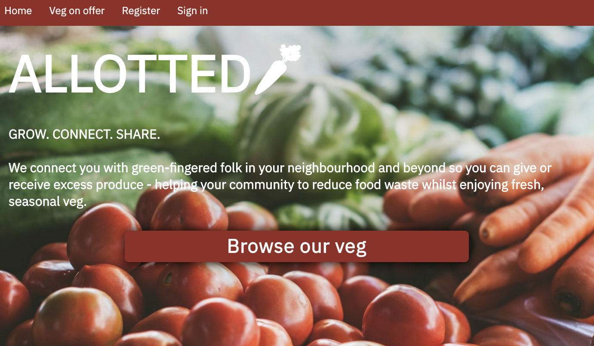
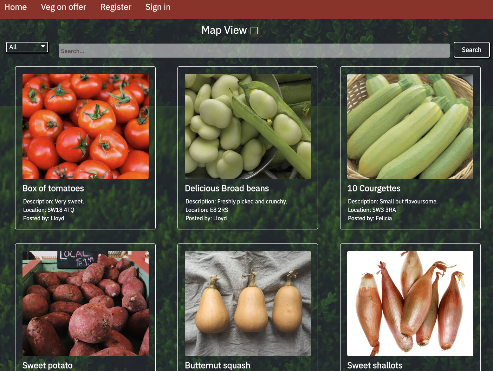
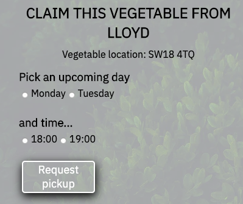
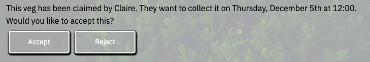
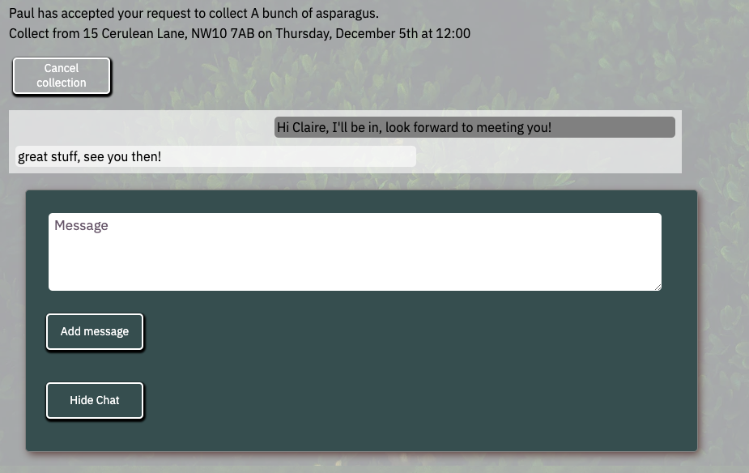

## Software Engineering Immersive at GA - Project 3: allotd

### Goal: To create a MERN stack app, working in teams

### Brief: [SEI GA Project 3 brief](project_3_brief.md)

### Timeframe: 10 days

### Group: 
Myself, [Claire Smith](https://github.com/clairesmi), [Jenny Judova](https://github.com/JennyJudova) and [Lloyd Noone](https://github.com/lloydnoone)

---

### Technologies used
* React.js
* JavaScript (ES6) / HTML5 / CSS3
* Express
* MongoDB & Mongoose
* Git / Github
* Heroku
* Trello

### Deployment
The app is deployed on Heroku and can be found here: [https://allotd-group-project.herokuapp.com/]()

### Overview

Our group made a platform for people who grow their own veg to easily share it. We were a team of 4 and used trello as a kanban board to manage our workload. I worked mostly on the back end using Express and MongoDB, the set up and structure of the React app, the appointment booking system, the user dashboard and our solution for user messaging. These are the areas I will cover below, though the app has many nice features built by the other members of the team that I would encourage you to explore.



#### How it works

The app is a two sided sharing platform. Users can be veg growers who want to share, people who want to collect veg from others or both.

Veg that is being offered by other users can be browsed from the 'veg on offer' page, either in tile view or toggled to map view and there is a search by with live filters. The tiles show a short summary of the veg available and will indicate if it has already been claimed by someone else.



Individual veg can be viewed from here, and if you click the claim button it will take you to the sign in page. On signing in, it will push you back to the veg page so you can go ahead and claim it.

Once logged in, you can create veg listings or edit ones you created earlier, and when looking at other users listings you can claim them. When a user creates a veg listing they select their preferences for collection, whcih days and times they are available. When you claim a veg you pick a day of the week (it defaults in the invitation to the next available Monday or Tuesday, etc) and the time you would like to collect and this triggers a claim notification to the user that posted the veg. You won't see the claim options if someone has already claimed the veg. Appointment/claim management is covered more further below.



Veg listings you have already made and veg you have made appointments to collect are all managed in your dashboard. For example, a to-and-fro between Paul and Claire, as Claire requests to collect some asparagus that Paul has listed:

Paul (the veg listing owner) sees this when Claire claims the veg and has the option to accept or reject the pickup, both of which send an appripriate notficication back to Claire:



On Claire's side, it looks like this, the collapsible message box shows the ongoing chat as well as the option for Claire to cancel the collection: 



In Paul's dashboard, he can also see this chat, as well as the options to cancel or mark as collected.

---

### Approach

#### The back end
The main challenge for us in the back end was setting up our models correctly. We opted for Users, Vegetables, Appointments and Messages. We did a good job but didn't account for the fact vegetables could have more than one appointment (cancelled and claimed by another user for example). As we were under time pressure we dealt with this by reusing the appointment for each veg listing, which required some extra logic but works fine.

Each appointment can have multiple messages and messages and this is how we dealt with chat. Originally we had hoped to use WebSockets but did not have time to learn this in the end, so we used a simple set interval to regularly check for new messages. The interval is cleared using componentWillUnmount.

#### Appointment system
The main components I worked in were the dashboard, along with the veg show, veg new, veg edit and veg chat components as I spent a lot of time doing the appointment system.

Appointments were tricky, they need to contain information that gets updated by a variety of actions - the two users involved, the veg, the time and date, and importantly the status of the appointment. There are 5 possible appointment statusses:

* requested
* rejected
* accepted
* cancelled
* completed

Each time a action was taken on an appointment, the status needed to be updated and the relevant messages correctly displayed to the other user. We also needed to udpate the status of the veg ('claimed' or not, so no one else could also claim it or to free it up). For example, this is the appointment rejection handler which both updates the status of the appointment and the claimed status of the veg:

```javascript
handleReject(appointmentId, vegetableId) {
  axios.patch(`/api/appointments/${appointmentId}`, { appointmentStatus: 'rejected' })
    .then(() => axios.patch(`/api/vegetables/${vegetableId}`, { isClaimed: false }))
    .then(() => this.getUserInfo())
    .catch(err => console.log(err))
}
```

The main challenge with this was making sure that users conditionally saw the correct notifications about their listings and pickups in their dashboards, we used a lot of guard clauses to accomplish this.

Setting dates on appointments was done with moment: 

```javascript
setDateAndTime(day, hour) {
  const dayArray = [ 'Monday', 'Tuesday', 'Wednesday', 'Thursday', 'Friday', 'Saturday', 'Sunday' ]
  if (moment().isoWeekday() <= dayArray.indexOf(day) + 1) {
    return moment().hour(parseInt(hour)).minute(0).second(0).day(dayArray.indexOf(day) + 1)._d
  } else {
    return moment().hour(parseInt(hour)).minute(0).second(0).day(dayArray.indexOf(day) + 1).add(1, 'weeks')._d
  }
}
```
#### Messaging system
I worked with Lloyd on this, one of the main things I learned here was how to use the callback part of setState:

```javascript
<form className='chatBox' onSubmit={(e) => {
  e.preventDefault()
  this.setState({ text: '' }, this.props.handleSubmitMessage(this.props.appointmentId, this.state.text))
}}>
``` 
Using the function we'd passed down in props in this way is how we made the messages render in real time and cleared the message box ready for the user to type again.

---

### Wins
* As a group of 4 we set ourselves an ambitious scope for the project, we worked well together and got through a lot. It meant that we all worked on different things, but we were there for debugging and problem solving. Given it was our first time using github for group work we managed the workflow well
* I learned a lot about props, setState and got much more familiar with react overall during this project
* The functionality overall is comprehensive for the time we had

### Challenges
* We had a shared vision for the app, except for the styling!
* Having to reuse the appointment on each veg was tricky
* Getting messages to rerender live was also a challenge to solve

### Future features or changes
* I would like to try and build some of the stuff the other team members did - maps and image upload for example
* I didn't work on the styling for this project, I'd like to give that a go given as are so many things going on - it's comfortably the largest of the projects I did on the GA course
* I'd love to implement a version of the messaging feature with WebSockets


